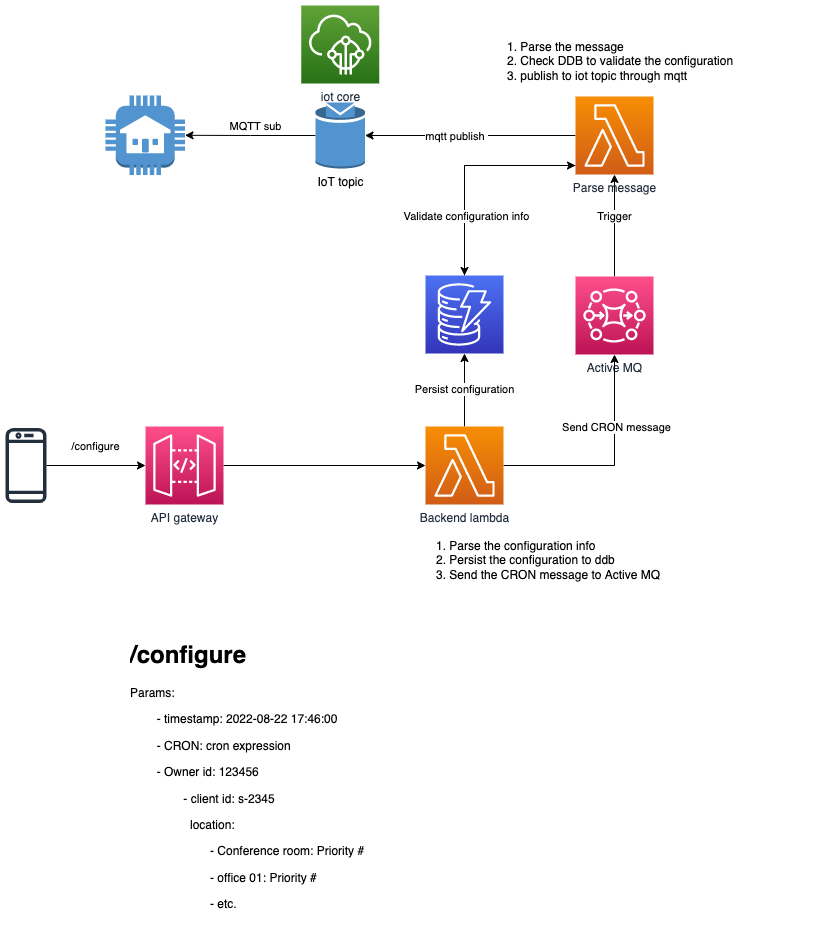

# Custom scheduler with AWS serverless

## Business cases

Customer would like a solution to enable them to periodically send customized message to their iot devices. At the moment, their IoT devices are centrally managed and controled by AWS IoT core and the current architecture is as the following graph.

Different devices are controlled by different IoT topics and a message should be sent to different IoT topics according to their end users requirements. Currently the way they achieved this is to set up a lambda to receive frontend request and utilize cloudformation stack to deploy a combination of eventbridge and lambda to send messages to different topics. This is actually sub-optimal since there is a limit on how many eventbridge rules can be deployed in one account.

If we think about the current setup, the reason why they had to deploy different combination of eventbridge rule and lambda is that the CRON rule provided by eventbridge can not send customized events. Instead, it can merely send out a fixed message to the target. If somehow we are able to pass some customized parameters to the target lambda in CRON manner, then the target lambda can then utilize the information inside those parameters to send messages to different IoT topics. In this way, we no longer need to keep deploying different eventbridge-lambda combinations for different IoT devices.

## Solution

There is one existing solution to enable customized messages for CRON job events, which is ActiveMQ. ActiveMQ is an opensource MQ infra that is able to create delayed queue which can schedule CRON messages to subscribers. With the help from Amazon MQ, users can easily setup infrastructure for ActiveMQ without any operation overhead. In addition, Amazon MQ can be the trigger for AWS Lambda as well, which further reduce the development cost for the architecture.

Therefore, with ActiveMQ at its core, the new architecture is like the following:

No more eventbridge or cloudformation!
ActiveMQ would be responsible to send out cron messages to lambda and a dynamodb is utilized as a persistent storage place for different user data and assist to keep the messages consistent throughout the process flows.

## Conclusion

This repo contains the infra code for deploying the new architecture. It can only used as a PoC. The code itself might be buggy and inclined to deployment errors. But it can serve as a starting point for implementing ActiveMQ on AWS.
